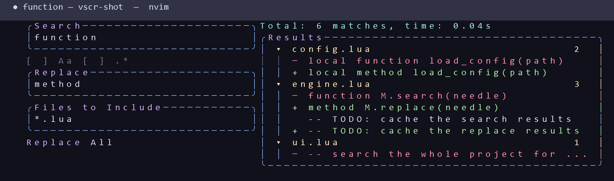

<div align="center">

# 🔍 VSCode Search & Replace

**VS Code-style project-wide search & replace for Neovim** — a floating two-panel
UI with live results, inline diff previews, and ripgrep speed. Built on
[nui-components.nvim](https://github.com/grapp-dev/nui-components.nvim).


</div>

<table>
  <tr>
    <th align="center">Search-only to start — the toggle boxes fill while active; press <code>⇄</code> for the full panel</th>
  </tr>
  <tr>
    <td align="center">
      
    </td>
  </tr>
</table>

## ✨ Features

- 🔍 live debounced results while you type (ripgrep)
- 🎨 inline red/green diff preview per match, with `\1`–`\9` capture references
- 🧩 bordered `⇄` / `ab` / `Aa` / `.*` / `AB` toggle boxes —
  they fill while active; `Tab` + `Enter`, `Alt+w` / `Alt+c` / `Alt+r` /
  `Alt+p` from anywhere in the float, or just click them with the mouse
- 🔎 search-only to start; pressing the `⇄` box left of Search reveals the
  replace row — `[Replace field] AB ⇉` — the search box never resizes,
  VS Code find-widget style; `AB` is `Preserve case`, `⇉` is Replace All
- 🖱️ every box, field and button is mouse-clickable (click a field to type,
  click a box to toggle it), VS Code style
- ✅ Replace All asks first with a Yes/No dialog (`y`/`n`, `Enter`/`Esc`, or
  click) before touching any file
- ❓ press `?` (or the `?` box on the search row) for the full keymap list
- 📂 current-file and word-under-cursor / visual-selection search variants
- ⚡ `<CR>` jumps straight to the match · `<C-R>` replaces everywhere (with a
  Yes/No confirmation)
- ⌨️ panel navigation with `Alt+h/j/k/l` — no plugin keymaps stolen from you
- 🔧 every glyph — the `⇄` / `ab` / `Aa` / `.*` / `AB` / `⇉` / `?` boxes and the
  tree chevrons — is overridable via the `icons` table in `setup()`

## ⚡️ Requirements

- Neovim ≥ 0.10
- [ripgrep](https://github.com/BurntSushi/ripgrep) (`rg`) on your `PATH`
- [Nerd Font](https://www.nerdfonts.com/) _(optional, for tree icons)_

## 📦 Installation

```lua
{
  "hungnguyen1503/nvim-vscode-search-replace",
  dependencies = { "grapp-dev/nui-components.nvim", "MunifTanjim/nui.nvim" },
  cmd = "SearchReplace",
  opts = {}, -- or call setup() by hand, see below
  keys = {
    {
      "<leader>S",
      mode = "n",
      function()
        require("vscode-search-replace").open()
      end,
      desc = "Search & Replace",
    },
    {
      "<leader>sw",
      mode = { "n", "v" },
      function()
        require("vscode-search-replace").open({ word = true })
      end,
      desc = "Search word under cursor / selection",
    },
    {
      "<C-F>",
      mode = "n",
      function()
        require("vscode-search-replace").open({ file = true, word = true })
      end,
      desc = "Search word under cursor in current file",
    },
  },
}
```

## ⚙️ Configuration

**nvim-vscode-search-replace** works out of the box. Please refer to the default settings below.

<details><summary>Default Settings</summary>

```lua
require("vscode-search-replace").setup({
  -- float anchor: "center" | "top" | "bottom" | "left" | "right"
  position = "center",
  -- width:  <= 1 → fraction of the editor;  > 1 → absolute columns
  width = 0.9,
  -- height: <= 1 → fraction of the editor;  > 1 → absolute lines
  height = 0.85,
  -- ms after the last keystroke before the re-search fires
  debounce = 300,
  -- every glyph is overridable; omitted keys keep the defaults below
  icons = {
    tree_expanded = "\u{F107}", -- chevron before an expanded file row
    tree_collapsed = "\u{F105}", -- chevron before a collapsed file row
    replace_mode = "⇄", -- search row box: show/hide the replace row
    replace_all = "⇉", -- Replace All box
    help = "?", -- help box
    case = "Aa",
    whole_word = "ab",
    regex = ".*",
    preserve_case = "AB",
  },
})
```

</details>

## 🚀 Usage

Open with `:SearchReplace` (`:h vscode-search-replace` for the full help), or
call the Lua API — `opts = {}` searches the whole project (cwd), `{ file = true }`
the current file only, `{ word = true }` prefills the pattern from the visual
selection / word under cursor and searches immediately:

```lua
require("vscode-search-replace").open()
require("vscode-search-replace").open({ file = true, word = true })
```

The float opens in search-only mode; press the `⇄` box (left of Search) to show
the replace row: the replace field, the `AB` (Preserve case) box and the `⇉`
(Replace All) icon box.

### Preserve case (`AB`)

When on, each replacement re-cases itself to the text it replaced: an ALL-CAPS
match gets an ALL-CAPS replacement, a Title-case match gets a Title-case one
(`foo` → `bar`, `FOO` → `BAR`, `Foo` → `Bar`); mixed-case matches are left as
typed. Case-code escapes in the replacement (`\u`, `\U`, `\l`, `\L`) are not
applied while `AB` is on — the match decides the case — and a bare `&` or `%`
in the replacement inserts itself literally.

Troubleshooting: `:checkhealth vscode-search-replace`

## ⌨️ Keymaps

Every panel is reachable — `Tab`/`Shift+Tab` or `Alt+j`/`Alt+k` to walk,
`Enter`/`Space` or a mouse click to activate — and the `Alt` hotkeys work from
wherever focus is. Press `?` inside the float to see this list.

| Keymap                | Mode  | Description                                      |
| --------------------- | ----- | ------------------------------------------------ |
| `<Tab>` / `<S-Tab>`   | n/i   | next / previous panel                            |
| `Alt+h` / `Alt+l`     | n/i   | sidebar ⇄ results tree                           |
| `Alt+j` / `Alt+k`     | n/i   | previous / next panel in focus order             |
| `Enter` / `Space` / click | n/i | activate focused widget · jump to selected match |
| `Alt+c`               | n/i   | toggle `Aa` — match case                         |
| `Alt+w`               | n/i   | toggle `ab` — match whole word                   |
| `Alt+r`               | n/i   | toggle `.*` — regular expression                 |
| `Alt+p`               | n/i   | toggle `AB` — preserve case                      |
| `Ctrl+r`              | n/i   | Replace All — asks Yes/No first                  |
| `y` / `n` · `Enter` / `Esc` | n | answer the Replace All dialog (or click `Yes`/`No`) |
| `?`                   | n     | show/hide the keymap help                        |
| `q` / `Esc` / `<C-f>` | n/i   | close                                            |
| `zc`                  | n     | collapse all files in the tree (press again to expand) |

## 🙏 References

- [NuiComponents Showcase](https://nui-components.grapp.dev/docs/showcase) — the
  component library this UI is built on
- [nui.nvim](https://github.com/MunifTanjim/nui.nvim) — UI primitives
